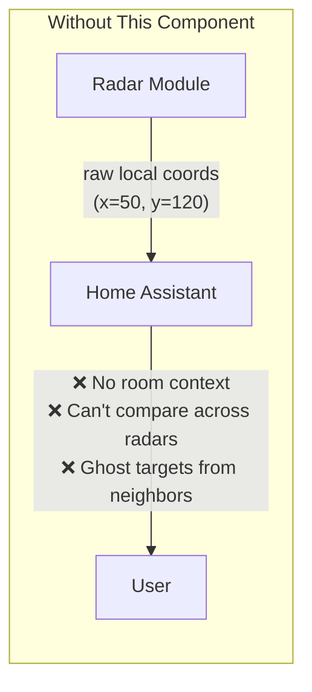
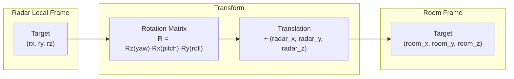
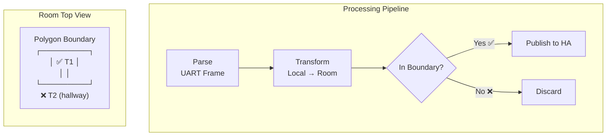

# MMWave Radar ESPHome Component

[](https://github.com/zomco/mmwave-component/actions/workflows/ci.yml)
[](https://github.com/zomco/mmwave-component/actions/workflows/publish.yml)

[中文文档](./README_CN.md)

Custom [ESPHome](https://esphome.io/) external components for multiple millimeter-wave radar models, targeting **ESP32-C3** (with planned ESP32-S3 and other MCU support). Includes built-in **coordinate transformation** and **boundary filtering**.

> **🔌 Install firmware directly in your browser →** [**Open Installer**](https://zomco.github.io/mmwave-component/)
>
> No software required. Requires Chrome or Edge with Web Serial support.

---

## Features

### Problem: Why Are These Features Needed?

Most existing mmWave radar components for ESPHome expose only raw sensor data (distance, presence, target coordinates in the radar's local frame). This works for single-sensor, single-room setups but falls apart in real-world deployments:



| Problem | Description | Example |
|---|---|---|
| **Coordinate ambiguity** | Raw radar coordinates are relative to the radar's own antenna. The same physical location yields different (x, y) values depending on how the radar is mounted (rotated, tilted, off-center). | A radar mounted on the ceiling facing down reports `y = 120 cm`, but this is actually a target at the doorway — which in room coordinates would be `room_x = 350, room_y = 80`. Without transformation, automations must hard-code per-installation offsets. |
| **No multi-radar fusion** | Two radars in the same room report independent local coordinates with no shared reference frame. It's impossible to correlate targets or deduplicate. | Radar A reports a target at (50, 120), Radar B reports one at (80, 90). Are these the same person or two people? Impossible to tell without a common coordinate system. |
| **Cross-room false positives** | mmWave signals can penetrate thin walls, glass, and doors. A radar may detect people in adjacent rooms, hallways, or even outdoors. There is no mechanism to discard out-of-bounds targets. | A bedroom sleep radar detects someone walking in the hallway, triggering a false "in bed" state at 3 AM. |

---

### Solution 1: Coordinate Transformation

Converts raw radar-local target positions into **room-frame coordinates**, based on the radar's physical installation parameters.



**How it works:**

1. The user measures the radar's position in the room (origin at corner, X right, Y forward) and its orientation (yaw, pitch, roll).
2. These 6 parameters are declared in YAML at compile time, or adjusted at runtime via Home Assistant `number` entities.
3. On every target report, the component:
   - Builds a 3×3 rotation matrix using ZYX Tait-Bryan convention: **R = Rz(yaw) · Rx(pitch) · Ry(roll)**
   - Computes: `world = R × [rx, ry, rz]ᵀ`
   - Translates: `room = world + [radar_x, radar_y, radar_z]ᵀ`
4. The resulting `room_x`, `room_y`, `room_z` are published as ESPHome sensor entities.

```yaml
r60abd1:
  radar_x: 200.0      # cm — distance from left wall
  radar_y: 175.0      # cm — distance from back wall
  radar_z: 220.0      # cm — mounting height
  yaw:   0.0           # degrees — horizontal heading offset
  pitch: 0.0           # degrees — elevation tilt
  roll:  0.0           # degrees — bank/roll
```

**What it solves:**
- ✅ All targets are in a unified room coordinate system, regardless of how the radar is mounted.
- ✅ Multiple radars in the same room can share one reference frame, enabling target correlation.
- ✅ Automations reference real room locations (e.g., "target near the bed") instead of opaque radar-local values.

**Limitations:**
- ❌ The user must manually measure and enter the 6 calibration parameters. Accuracy depends on measurement precision (±5 cm is typical for manual measurement).
- ❌ Cannot compensate for radar hardware distortion (nonlinear range errors, multipath reflections, etc.).
- ❌ Does not perform multi-radar target fusion — each radar still publishes independently. The shared coordinate frame only makes fusion *possible* at the HA automation layer.

**Dimensionality mapping:**

Different radar models output different levels of positional detail. The transform adapts accordingly:

| Radar Output | Transform Input | Published Entities |
|---|---|---|
| 1-D (range only) | `(range, 0, 0)` | `room_x`, `room_y`, `room_z` |
| 2-D (X, Y) | `(lx, ly, 0)` | `room_x`, `room_y` |
| 3-D (X, Y, Z) | `(lx, ly, lz)` | `room_x`, `room_y`, `room_z` |

---

### Solution 2: Boundary Filtering

Discards targets that fall outside a user-defined polygon, operating **exclusively in room-frame coordinates** (post-transform).



**How it works:**

1. The user defines a polygon in room coordinates (cm) representing the monitored area.
2. After coordinate transformation, the component tests each target's `(room_x, room_y)` against the polygon using the **Ray Casting algorithm** (O(n) per point, supports both convex and concave polygons).
3. Targets outside the polygon are silently dropped — they are never published to Home Assistant.

```yaml
r60abd1:
  polygon:
    - { x:   0, y:   0 }     # bottom-left corner
    - { x: 400, y:   0 }     # bottom-right
    - { x: 400, y: 350 }     # top-right
    - { x:   0, y: 350 }     # top-left
```

**What it solves:**
- ✅ Eliminates cross-room false positives (hallway, adjacent room, outdoor).
- ✅ Enables sub-room zoning (e.g., monitor only the bed area, not the bathroom).
- ✅ Works with arbitrary room shapes — not limited to rectangles.

**Limitations:**
- ❌ Filtering is 2-D only (XY projection). Cannot filter by height (Z axis). A target on a different floor directly above/below could still pass if the XY projection falls inside the polygon.
- ❌ Requires at least 3 polygon vertices to activate. Fewer than 3 vertices disables filtering (pass-through).
- ❌ Cannot filter "soft" false positives caused by multipath reflections that appear to originate from inside the polygon.

---

### End-to-End Processing Pipeline

The complete data flow for every radar frame:


> **Processing order is mandatory:** Parse → Transform → Filter → Publish. The transform must happen before filtering because the polygon is defined in room coordinates.

---

## Radar Model Status

| Radar Model | Status | Dimension | Application | Docs |
|---|---|---|---|---|
| R60ABD1 | ✅ Completed | 3D (X, Y, Z) | Breathing & sleep monitoring, presence detection, heart rate | [Documentation](docs/r60abd1/README.md) |

### Status Definitions

| Status | Description |
|---|---|
| `Planned` | Documentation staged; component not yet generated. |
| `Developing` | Component generated; undergoing on-hardware firmware tests. |
| `Testing` | Firmware validated; undergoing Home Assistant integration tests. |
| `Completed` | HA integration validated and stable. |
| `Paused` | Blocked by an external condition (no hardware, no test environment, etc.). |

> This table is the authoritative source of truth, updated on every status change.

---

## Repository Structure

```
.
├── .github/
│   ├── copilot-instructions.md   # AI development guide & CI/CD docs
│   └── workflows/
│       ├── ci.yml                # PR check: compiles all tests/*.yaml
│       ├── publish.yml           # Builds firmware, uploads artifacts
│       └── publish-pages.yml     # Deploys GitHub Pages (separate from firmware build)
├── components/{radar_model}/     # ESPHome external component
├── docs/{radar_model}/           # Product docs, wiring images, usage guide (README.md)
├── static/                       # GitHub Pages source (Jekyll)
│   ├── _config.yml
│   └── index.html                # ESP Web Tools install page
├── tests/
│   ├── {radar_model}-{platform}.yaml          # Base firmware config
│   └── {radar_model}-{platform}.factory.yaml  # Factory firmware config
└── README.md
```

---

## License

MIT