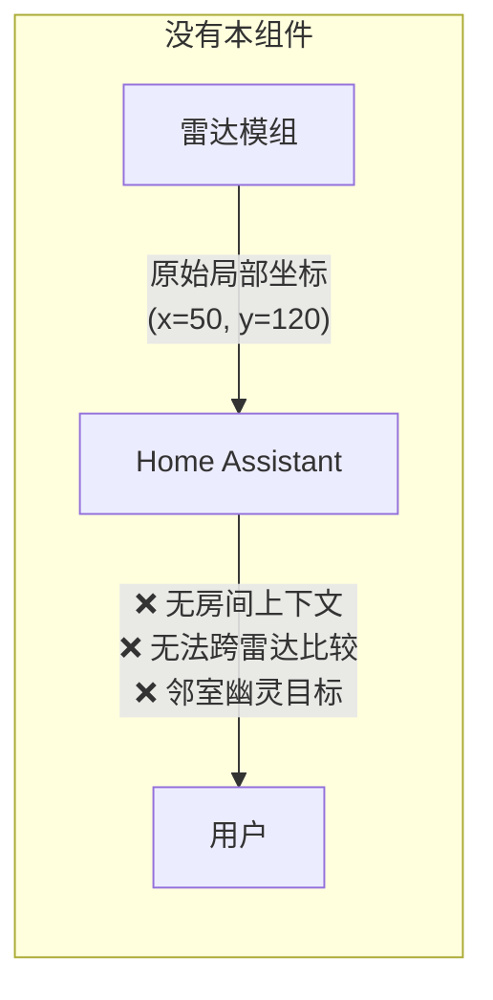
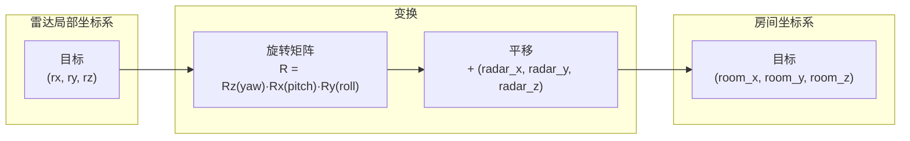
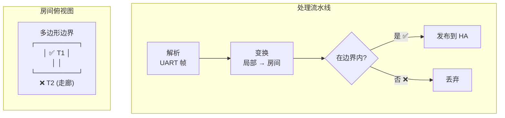

# 毫米波雷达 ESPHome 组件

[](https://github.com/zomco/mmwave-component/actions/workflows/ci.yml)
[](https://github.com/zomco/mmwave-component/actions/workflows/publish.yml)

[English](./README.md)

适用于多款毫米波雷达型号的自定义 [ESPHome](https://esphome.io/) 外部组件，目标平台 **ESP32-C3**（计划支持 ESP32-S3 及其他 MCU）。内置**坐标变换**和**边界过滤**功能。

> **🔌 在浏览器中直接安装固件 →** [**打开安装页**](https://zomco.github.io/mmwave-component/)
>
> 无需安装任何软件。需要 Chrome 或 Edge 浏览器（支持 Web Serial）。

---

## 功能特性

### 问题：为什么需要这些功能？

现有的大多数 ESPHome 毫米波雷达组件仅暴露原始传感器数据（距离、存在状态、雷达局部坐标系下的目标坐标）。这在单传感器、单房间的简单场景下可以使用，但在实际部署中会遇到以下问题：



| 问题 | 描述 | 示例 |
|---|---|---|
| **坐标歧义** | 原始雷达坐标相对于雷达天线自身。同一物理位置会因雷达的安装方式（旋转、倾斜、偏心）产生不同的 (x, y) 值。 | 安装在天花板朝下的雷达报告 `y = 120 cm`，实际目标在门口——对应房间坐标为 `room_x = 350, room_y = 80`。没有坐标变换，自动化必须为每个安装位置硬编码偏移量。 |
| **无法多雷达融合** | 同一房间的两个雷达各自报告独立的局部坐标，没有共享参考系。无法关联目标或去重。 | 雷达 A 报告目标在 (50, 120)，雷达 B 报告在 (80, 90)。这是同一个人还是两个人？没有统一坐标系无法判断。 |
| **跨房间误报** | 毫米波信号可以穿透薄墙、玻璃和门。雷达可能检测到相邻房间、走廊甚至室外的人。没有机制丢弃越界目标。 | 卧室睡眠雷达检测到走廊中走动的人，在凌晨 3 点触发了错误的"在床"状态。 |

---

### 方案一：坐标变换

基于雷达的物理安装参数，将原始雷达局部坐标转换为**房间坐标系**。



**工作原理：**

1. 用户测量雷达在房间中的位置（以房间角落为原点，X 向右，Y 向前）和姿态（偏航角、俯仰角、横滚角）。
2. 这 6 个参数在 YAML 中编译时声明，也可在运行时通过 Home Assistant `number` 实体调整。
3. 每次收到目标上报时，组件执行：
   - 使用 ZYX Tait-Bryan 约定构建 3×3 旋转矩阵：**R = Rz(yaw) · Rx(pitch) · Ry(roll)**
   - 计算：`world = R × [rx, ry, rz]ᵀ`
   - 平移：`room = world + [radar_x, radar_y, radar_z]ᵀ`
4. 变换后的 `room_x`、`room_y`、`room_z` 作为 ESPHome sensor 实体发布。

```yaml
r60abd1:
  radar_x: 200.0      # cm — 距左墙距离
  radar_y: 175.0      # cm — 距后墙距离
  radar_z: 220.0      # cm — 安装高度
  yaw:   0.0           # 度 — 水平朝向偏差
  pitch: 0.0           # 度 — 俯仰角
  roll:  0.0           # 度 — 横滚角
```

**解决了什么：**
- ✅ 所有目标都在统一的房间坐标系中，与雷达的安装方式无关。
- ✅ 同一房间的多个雷达可以共享同一参考系，实现目标关联。
- ✅ 自动化引用真实房间位置（如"目标在床附近"），而不是不透明的雷达局部坐标值。

**局限性：**
- ❌ 用户必须手动测量并输入 6 个校准参数。精度取决于测量精度（手动测量典型误差 ±5 cm）。
- ❌ 无法补偿雷达硬件失真（非线性距离误差、多径反射等）。
- ❌ 不执行多雷达目标融合——每个雷达仍独立发布。共享坐标系仅使融合在 HA 自动化层面*成为可能*。

**维度映射：**

不同雷达型号输出不同层级的位置信息。变换相应适配：

| 雷达输出 | 变换输入 | 发布的实体 |
|---|---|---|
| 1D（仅距离） | `(range, 0, 0)` | `room_x`, `room_y`, `room_z` |
| 2D（X, Y） | `(lx, ly, 0)` | `room_x`, `room_y` |
| 3D（X, Y, Z） | `(lx, ly, lz)` | `room_x`, `room_y`, `room_z` |

---

### 方案二：边界过滤

丢弃落在用户定义多边形外的目标，**完全在房间坐标系中运作**（变换之后）。



**工作原理：**

1. 用户用房间坐标（cm）定义一个多边形，表示监测区域。
2. 坐标变换后，组件使用**射线法（Ray Casting）**（每点 O(n)，支持凸多边形和凹多边形）检测每个目标的 `(room_x, room_y)` 是否在多边形内。
3. 多边形外的目标被静默丢弃——不会发布到 Home Assistant。

```yaml
r60abd1:
  polygon:
    - { x:   0, y:   0 }     # 左下角
    - { x: 400, y:   0 }     # 右下角
    - { x: 400, y: 350 }     # 右上角
    - { x:   0, y: 350 }     # 左上角
```

**解决了什么：**
- ✅ 消除跨房间误报（走廊、相邻房间、室外）。
- ✅ 支持房间内分区（如仅监测床区域，不包含卫生间）。
- ✅ 支持任意房间形状——不限于矩形。

**局限性：**
- ❌ 过滤仅基于 2D（XY 投影）。无法按高度（Z 轴）过滤。不同楼层正上方/正下方的目标如果 XY 投影落在多边形内，仍会通过。
- ❌ 至少需要 3 个多边形顶点才能激活。少于 3 个顶点时过滤功能禁用（直通）。
- ❌ 无法过滤由多径反射引起的"软"误报，即看起来来源于多边形内部的虚假目标。

---

### 端到端处理流水线

每个雷达帧的完整数据流：


> **处理顺序是强制的：** 解析 → 变换 → 过滤 → 发布。变换必须在过滤之前，因为多边形是在房间坐标系中定义的。

---

## 雷达型号状态

| 雷达型号 | 状态 | 维度 | 应用场景 | 文档 |
|---|---|---|---|---|
| R60ABD1 | ✅ 已完成 | 3D (X, Y, Z) | 呼吸与睡眠监测、存在检测、心率 | [使用文档](docs/r60abd1/README.md) |

### 状态定义

| 状态 | 描述 |
|---|---|
| `Planned` | 文档已准备；组件尚未生成。 |
| `Developing` | 组件已生成；正在进行硬件固件测试。 |
| `Testing` | 固件已验证；正在进行 Home Assistant 集成测试。 |
| `Completed` | HA 集成已验证，运行稳定。 |
| `Paused` | 受外部条件阻塞（无硬件、无测试环境等）。 |

> 此表为权威信息来源，每次状态变更时更新。

---

## 仓库结构

```
.
├── .github/
│   ├── copilot-instructions.md   # AI 开发指南 & CI/CD 文档
│   └── workflows/
│       ├── ci.yml                # PR 检查：编译所有 tests/*.yaml
│       ├── publish.yml           # 构建固件，上传产物
│       └── publish-pages.yml     # 部署 GitHub Pages（与固件构建分离）
├── components/{radar_model}/     # ESPHome 外部组件
├── docs/{radar_model}/           # 产品文档、接线图、使用说明 (README.md)
├── static/                       # GitHub Pages 源文件 (Jekyll)
│   ├── _config.yml
│   └── index.html                # ESP Web Tools 安装页
├── tests/
│   ├── {radar_model}-{platform}.yaml          # 基础固件配置
│   └── {radar_model}-{platform}.factory.yaml  # 出厂固件配置
└── README.md
```

---

## 许可证

MIT
